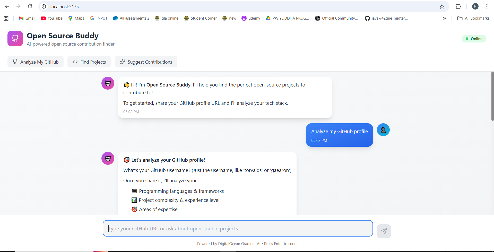

# 🚀 Open Source Buddy# 🚀 Open Source Buddy



**AI-powered open-source contribution finder** that helps developers discover and contribute to open-source projects based on their GitHub profile and tech stack!**AI-powered open-source contribution finder** - Find the perfect open-source projects to contribute to based on your GitHub profile and tech stack!


Built with ❤️ using React + Vite + DigitalOcean Gradient AIBuilt for hackathons with ❤️ using React + Vite + DigitalOcean Gradient AI


---

---

## ✨ Features

## 🎥 Live Demo

### 🔍 **GitHub Profile Analysis**

**🔗 Live Demo:** [Deploy your app and add URL here]Paste your GitHub URL and get instant analysis of your tech stack, languages, and expertise


**📹 Demo Video/GIF:** See below for demo walkthrough### 🎯 **Smart Project Recommendations**

AI suggests 3-5 active open-source projects matching your skills with "good first issue" labels


### 💡 **Contribution Guidance**

> **Note:** Demo GIF can be created using tools like [ScreenToGif](https://www.screentogif.com/) or [LICEcap](https://www.cockos.com/licecap/)Get specific advice on which files/modules to start with and open issues you can tackle


---### 🎨 **Beautiful Chat UI**

Modern interface with smooth animations, dark mode support, and quick action buttons

## 📖 Project Summary

---

**Open Source Buddy** is an intelligent AI agent that:

- 🔍 Analyzes your GitHub profile to understand your tech stack## 🚀 Quick Start

- 🎯 Recommends matching open-source projects using web browsing and knowledge base

- 💡 Suggests specific contribution areas and "good first issues"```bash

- 🤖 Provides conversational guidance through natural language chat# Install dependencies

npm install

### Problem It Solves

Open source contribution is intimidating for newcomers. Finding the right project matching your skills and identifying where to start is time-consuming. Open Source Buddy automates this entire process using AI.# Start development server

npm run dev

### Key Innovation```

- **Context-aware suggested prompts** that guide users through the entire journey

- **Conversational username input** for natural interactionApp opens at `http://localhost:5173/` 🎉

- **Real-time web browsing** to analyze GitHub profiles

- **Knowledge base integration** with open-source best practices**Note:** Works in demo mode without API keys using mock data!


------


## ✨ Features## 🔧 DigitalOcean Gradient AI Setup (Optional)


### 🔍 **GitHub Profile Analysis**1. Create account at [DigitalOcean Cloud](https://cloud.digitalocean.com/)

- Paste your GitHub username or URL2. Create a Gradient AI Agent with web browsing enabled

- AI analyzes your repositories, languages, and frameworks3. Copy your agent's endpoint URL and API key

- Assesses experience level and expertise areas4. Add to `.env` file:

- Provides detailed tech stack summary

```env

### 🎯 **Smart Project Recommendations**VITE_AGENT_API_URL=https://your-agent-endpoint.digitalocean.com

- AI searches for 3-5 active open-source projects matching your skillsVITE_AGENT_API_KEY=your_api_key_here

- Filters for beginner-friendly repos with "good first issue" tags```

- Shows project stars, tech stack, and why it's a good fit

- All recommendations are from actively maintained projects---


### 💡 **Contribution Guidance**## 💻 Usage

- Suggests specific files/modules to focus on

- Lists open issues you can tackle1. **Analyze GitHub**: `https://github.com/yourusername`

- Provides setup and contribution workflow2. **Find Projects**: Click "Find Projects" button

- Explains project structure and best practices3. **Get Guidance**: Ask "How can I contribute to [repo]?"


### 🎨 **Modern Chat Interface**---

- Beautiful UI with smooth animations

- Dark mode support## 📁 Project Structure

- Context-aware suggested prompts (guides next steps)

- Quick action buttons for common tasks```

- Full markdown rendering for rich responsessrc/

- Mobile responsive design├── components/ChatInterface.jsx    # Main chat UI

├── services/agentService.js        # AI integration

---└── App.jsx                         # Root component

```

## 🚀 Setup & Run Steps

---

### Prerequisites

- Node.js 20.19+ or 22.12+ (recommended)## 🚢 Deploy to DigitalOcean

- npm or yarn package manager

- Git1. Push to GitHub

2. Create App on DigitalOcean App Platform

### Installation3. Connect repository

4. Add environment variables

```bash5. Deploy! 🎉

# 1. Clone the repository

git clone https://github.com/yourusername/open-source-buddy.git---

cd open-source-buddy

## 🎯 Built For Hackathons

# 2. Install dependencies

npm install✅ Frontend-only (no backend needed)  

✅ Mock mode for demos  

# 3. Create environment file (optional - works without API key in demo mode)✅ Modern UI  

cp .env.example .env✅ AI-powered  

✅ Easy to deploy  

# 4. Add your DigitalOcean Gradient AI credentials (optional)✅ Well-documented  

# Edit .env and add:

# VITE_AGENT_API_URL=https://your-agent-endpoint.agents.do-ai.run---

# VITE_AGENT_API_KEY=your_api_key_here

## 🙏 Tech Stack

# 5. Start development server

npm run dev- React 19 + Vite

- TailwindCSS 3.x

# 6. Open browser- DigitalOcean Gradient AI

# Navigate to http://localhost:5173/- Lucide React Icons

```- Axios


### Quick Start (No API Setup)---

The app works in **demo mode** with mock responses if you don't configure the API. Just run:

```bash## 📝 License

npm install && npm run dev

```MIT - Free for hackathons, learning, and commercial use!


### DigitalOcean Gradient AI Setup (For Real AI)---


1. **Create Account**: Sign up at [DigitalOcean Cloud](https://cloud.digitalocean.com/)**Happy Contributing! 🚀**

2. **Create Agent**: 
   - Go to AI > Agents
   - Click "Create Agent"
   - Choose "OpenAI GPT" model
   - Enable "Web Browsing"
   - Add knowledge base (upload open-source project lists)
3. **Get Credentials**:
   - Copy agent endpoint URL
   - Generate API key
4. **Configure App**:
   ```env
   VITE_AGENT_API_URL=https://your-endpoint.agents.do-ai.run
   VITE_AGENT_API_KEY=your_api_key_here
   ```

---

## 📥 Expected Inputs

### Input Format Options:

1. **GitHub Username** (Recommended)
   ```
   torvalds
   gaearon
   tj
   ```

2. **Full GitHub URL**
   ```
   https://github.com/torvalds
   https://github.com/facebook/react
   ```

3. **Natural Language Queries**
   ```
   "Analyze my GitHub profile"
   "Find open-source React projects"
   "How can I contribute to Next.js?"
   "Show me good first issues"
   ```

4. **Quick Actions** (Click buttons)
   - Analyze My GitHub
   - Find Projects
   - Suggest Contributions

---

## 📤 Expected Outputs

### 1. GitHub Profile Analysis
```markdown
🔍 GitHub Profile Analysis for @username

Languages & Frameworks:
- JavaScript / TypeScript (React, Next.js)
- Python (FastAPI, Flask)
- Docker, Kubernetes

Areas of Expertise:
- Full-stack web development
- REST API design
- Cloud-native deployment

Experience Level: Intermediate

Summary:
Developer with strong full-stack capabilities focusing on modern 
JavaScript frameworks and backend development.
```

### 2. Project Recommendations
```markdown
🚀 Matching Open-Source Projects

1. LangChain.js
   🔗 github.com/langchain-ai/langchainjs
   Stack: TypeScript, Node.js, AI/LLM
   ⭐ Stars: 11k+
   Why it's a good fit: Combines your JavaScript and AI interests

2. Strapi
   🔗 github.com/strapi/strapi
   Stack: Node.js, TypeScript, React
   ⭐ Stars: 60k+
   Why it's a good fit: Active full-stack project with good docs

[... 3-5 total projects]
```

### 3. Contribution Guidance
```markdown
🎯 Contribution Guide

Best Areas to Start:
1. Documentation (/docs) - Update setup instructions
2. Frontend Components (/src/components) - Add accessibility
3. Backend API (/server) - Improve error handling

Open Issues to Tackle:
- #234: "Add dark mode toggle" (good first issue)
- #189: "Improve mobile responsiveness"

Getting Started:
git clone https://github.com/[repo-name]
npm install
npm run dev
```

---

## 🏗️ Project Structure

```
open-source-buddy/
├── src/
│   ├── components/
│   │   ├── ChatInterface.jsx      # Main chat UI with suggestions
│   │   └── WelcomeScreen.jsx      # Optional intro screen
│   ├── services/
│   │   └── agentService.js        # AI integration & intent detection
│   ├── App.jsx                    # Root component
│   ├── App.css                    # Custom styles & markdown prose
│   ├── index.css                  # Tailwind directives
│   └── main.jsx                   # Entry point
├── public/                        # Static assets
├── .env                          # Environment variables (gitignored)
├── .env.example                  # Environment template
├── package.json                  # Dependencies
├── vite.config.js               # Vite configuration
├── tailwind.config.js           # TailwindCSS configuration
├── README.md                    # This file
├── LICENSE                      # MIT License
├── CONTRIBUTING.md              # Contribution guide
├── CODE_OF_CONDUCT.md          # Code of conduct
└── requirements.txt            # Python dependencies (if any)
```

---

## 🛠️ Technology Stack

### Frontend
- **React 19.1.1** - UI library
- **Vite 7.1.9** - Build tool and dev server
- **TailwindCSS 3.x** - Utility-first CSS framework
- **Lucide React** - Icon library
- **react-markdown** - Markdown rendering
- **remark-gfm** - GitHub Flavored Markdown support

### AI/Backend
- **DigitalOcean Gradient AI** - AI agent with web browsing
- **OpenAI-compatible API** - Chat completions format
- **Axios** - HTTP client

### Development Tools
- **ESLint** - Code linting
- **PostCSS** - CSS processing
- **Autoprefixer** - CSS vendor prefixes

---

## 🚢 Deployment

### Deploy to DigitalOcean App Platform

```bash
# 1. Push to GitHub
git add .
git commit -m "Ready for deployment"
git push origin main

# 2. Create App on DigitalOcean
# - Go to App Platform
# - Click "Create App"
# - Connect your GitHub repository
# - Select the repository

# 3. Configure Build Settings
# Build Command: npm run build
# Output Directory: dist
# Run Command: (leave empty for static site)

# 4. Add Environment Variables
# VITE_AGENT_API_URL=your_endpoint
# VITE_AGENT_API_KEY=your_api_key

# 5. Deploy!
```

### Deploy to Vercel

```bash
npm install -g vercel
vercel

# Follow prompts, add environment variables in Vercel dashboard
```

### Deploy to Netlify

```bash
npm install -g netlify-cli
npm run build
netlify deploy --prod --dir=dist

# Add environment variables in Netlify dashboard
```

---

## 🧪 Testing

### Manual Testing
```bash
# Start dev server
npm run dev

# Test cases:
# 1. Click "Analyze My GitHub" → Enter username
# 2. Type "torvalds" → Should analyze profile
# 3. Click suggested prompt "Find matching projects"
# 4. Verify markdown rendering (headers, lists, links)
# 5. Test dark mode (system settings)
# 6. Test mobile responsive (resize browser)
```

### Testing Without API
The app includes comprehensive mock responses for all features:
- GitHub profile analysis
- Project recommendations
- Contribution guidance

Just run without configuring `.env` file!

---

## 📊 Performance

- ⚡ **Fast Load Time**: Vite's optimized build
- 🎨 **Smooth Animations**: CSS transitions and transforms
- 📱 **Mobile Optimized**: Responsive design, touch-friendly
- 🌙 **Dark Mode**: System preference detection
- ♿ **Accessible**: Semantic HTML, ARIA labels

---

## 🤝 Contributing

We welcome contributions! See [CONTRIBUTING.md](CONTRIBUTING.md) for guidelines.

Quick start:
```bash
# Fork the repo
# Create feature branch
git checkout -b feature/amazing-feature

# Make changes
# Commit with descriptive message
git commit -m "Add amazing feature"

# Push and create Pull Request
git push origin feature/amazing-feature
```

---

## 📄 License

This project is licensed under the MIT License - see the [LICENSE](LICENSE) file for details.

**TL;DR**: Free to use, modify, and distribute for personal, educational, and commercial purposes!

---

## 🙏 Acknowledgments

- **DigitalOcean** - For Gradient AI platform
- **React Team** - For amazing UI library
- **Vite Team** - For blazing fast build tool
- **TailwindCSS** - For beautiful utility classes
- **Open Source Community** - For inspiration and support

---

## 📞 Contact & Support

- **Issues**: [GitHub Issues](https://github.com/yourusername/open-source-buddy/issues)
- **Discussions**: [GitHub Discussions](https://github.com/yourusername/open-source-buddy/discussions)
- **Email**: your.email@example.com

---

## 🎯 Roadmap

- [ ] GitHub OAuth integration
- [ ] Save favorite projects
- [ ] Contribution history tracking
- [ ] Multi-language support
- [ ] Browser extension
- [ ] VS Code extension

---

## 🏆 Hackathon Submission

**Built for:** [Your Hackathon Name]  
**Category:** AI/ML, Developer Tools, Open Source  
**Team:** [Your Team Name]  
**Date:** October 4, 2025

---

**Made with ❤️ by developers, for developers!**

**Happy Contributing! 🚀**
